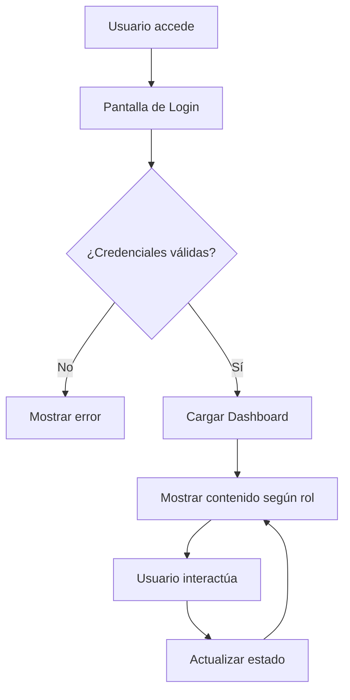

# 📚 Documentación Técnica Completa
## Sistema de Citas Médicas - Demo Web Service

---

## 📋 Tabla de Contenidos

1. [Introducción y Arquitectura](#1-introducción-y-arquitectura)
2. [Configuración del Proyecto](#2-configuración-del-proyecto)
3. [Estructura de Archivos](#3-estructura-de-archivos)
4. [Componentes React](#4-componentes-react)
5. [Gestión de Datos](#5-gestión-de-datos)
6. [Estilos y Diseño](#6-estilos-y-diseño)
7. [Configuración de Despliegue](#7-configuración-de-despliegue)
8. [Flujo de la Aplicación](#8-flujo-de-la-aplicación)
9. [Casos de Uso](#9-casos-de-uso)
10. [Troubleshooting](#10-troubleshooting)

---

## 1. Introducción y Arquitectura

### 🎯 **Propósito del Proyecto**

Este proyecto es una **demostración completa** de un sistema web moderno para la gestión de citas médicas. Está diseñado para:

- **Fines educativos**: Mostrar tecnologías web modernas en acción
- **Demostración profesional**: Interfaz corporativa y funcional
- **Casos de uso reales**: Simulación de un sistema médico real

### 🏗️ **Arquitectura General**

```
┌─────────────────────────────────────────────────────────────┐
│                    FRONTEND (Next.js)                      │
├─────────────────────────────────────────────────────────────┤
│  ┌─────────────┐  ┌─────────────┐  ┌─────────────┐        │
│  │   Login     │  │  Dashboard  │  │ Components  │        │
│  │   Form      │  │             │  │             │        │
│  └─────────────┘  └─────────────┘  └─────────────┘        │
├─────────────────────────────────────────────────────────────┤
│                    DATA LAYER                              │
│  ┌─────────────┐  ┌─────────────┐  ┌─────────────┐        │
│  │   Users     │  │ Appointments│  │   Doctors   │        │
│  │   Data      │  │    Data     │  │    Data     │        │
│  └─────────────┘  └─────────────┘  └─────────────┘        │
└─────────────────────────────────────────────────────────────┘
```

### 🛠️ **Stack Tecnológico**

#### **Frontend:**
- **Next.js 14**: Framework React con App Router
- **React 18**: Biblioteca de interfaz de usuario
- **Tailwind CSS**: Framework de estilos utilitarios
- **React Icons**: Iconografía profesional

#### **Herramientas de Desarrollo:**
- **ESLint**: Linting de código
- **PostCSS**: Procesamiento de CSS
- **Autoprefixer**: Compatibilidad de CSS

#### **Despliegue:**
- **Vercel**: Plataforma de hosting
- **Static Export**: Generación de sitio estático

---

## 2. Configuración del Proyecto

### 📦 **package.json**

```json
{
  "name": "medical-appointments-demo",
  "version": "1.0.0",
  "private": true,
  "scripts": {
    "dev": "next dev",
    "build": "next build",
    "start": "next start",
    "lint": "next lint",
    "export": "next build && next export"
  },
  "dependencies": {
    "next": "latest",
    "react": "latest",
    "react-dom": "latest",
    "tailwindcss": "latest",
    "autoprefixer": "latest",
    "postcss": "latest",
    "react-icons": "^5.2.1"
  },
  "devDependencies": {
    "eslint": "latest",
    "eslint-config-next": "latest"
  }
}
```

### ⚙️ **next.config.js**

```javascript
/** @type {import('next').NextConfig} */
const nextConfig = {
  reactStrictMode: true,
  swcMinify: true,
  output: 'export', // Para generar sitio estático
  trailingSlash: true, // Para compatibilidad con hosting estático
  images: {
    unoptimized: true, // Necesario para export estático
  },
  // Configuración para demo estática
  assetPrefix: process.env.NODE_ENV === 'production' ? '' : '',
  // Deshabilitar optimizaciones que requieren servidor
  experimental: {
    esmExternals: false,
  },
};

module.exports = nextConfig;
```

### 🎨 **tailwind.config.js**

```javascript
/** @type {import('tailwindcss').Config} */
module.exports = {
  content: [
    './pages/**/*.{js,ts,jsx,tsx,mdx}',
    './components/**/*.{js,ts,jsx,tsx,mdx}',
    './app/**/*.{js,ts,jsx,tsx,mdx}',
  ],
  theme: {
    extend: {
      fontFamily: {
        'sans': ['Source Sans Pro', 'Inter', 'system-ui', 'sans-serif'],
      },
    },
  },
  plugins: [],
}
```

### 🔧 **postcss.config.js**

```javascript
module.exports = {
  plugins: {
    tailwindcss: {},
    autoprefixer: {},
  },
}
```

---

## 3. Estructura de Archivos

```
Demo-web-service/
├── app/                          # App Router de Next.js
│   ├── globals.css              # Estilos globales con Tailwind
│   └── page.js                  # Página principal (Layout Root)
├── components/                   # Componentes React reutilizables
│   ├── LoginForm.js             # Formulario de autenticación
│   ├── Header.js                # Navegación principal
│   ├── Dashboard.js             # Panel de control principal
│   ├── AppointmentForm.js       # Formulario de reserva de citas
│   ├── DoctorList.js            # Lista y filtros de doctores
│   └── AppointmentList.js       # Lista y gestión de citas
├── lib/                         # Utilidades y datos
│   └── data.js                  # Datos simulados y funciones helper
├── out/                         # Directorio de build (generado)
├── .gitignore                   # Archivos ignorados por Git
├── next.config.js               # Configuración de Next.js
├── tailwind.config.js           # Configuración de Tailwind CSS
├── postcss.config.js            # Configuración de PostCSS
├── package.json                 # Dependencias y scripts
├── vercel.json                  # Configuración de despliegue
└── README.md                    # Documentación principal
```

### 📁 **Descripción de Directorios**

#### **`/app`** - App Router de Next.js
- **`globals.css`**: Estilos globales, imports de Tailwind, fuentes personalizadas
- **`page.js`**: Componente raíz que maneja el estado global y renderizado condicional

#### **`/components`** - Componentes React
- **Modulares**: Cada componente tiene una responsabilidad específica
- **Reutilizables**: Diseñados para ser usados en múltiples contextos
- **Props-based**: Comunicación entre componentes mediante props

#### **`/lib`** - Capa de Datos
- **`data.js`**: Datos simulados, funciones helper, constantes
- **Centralizado**: Toda la lógica de datos en un solo lugar

---

## 4. Componentes React

### 🔐 **LoginForm.js**

**Propósito**: Maneja la autenticación de usuarios con diferentes roles.

```javascript
'use client';

import { useState } from 'react';
import { FaHospital, FaUser, FaLock, FaInfoCircle, FaKey } from 'react-icons/fa';

export default function LoginForm({ onLogin, loading }) {
  const [formData, setFormData] = useState({
    email: '',
    password: '',
  });
  const [error, setError] = useState('');

  // ... resto del componente
}
```

**Características**:
- **Estado local**: Maneja email, password y errores
- **Validación**: Verifica credenciales contra datos simulados
- **Iconos**: Usa React Icons para interfaz profesional
- **Responsive**: Diseño adaptativo para móviles

**Props**:
- `onLogin`: Función callback para manejar login exitoso
- `loading`: Estado de carga para deshabilitar formulario

### 🧭 **Header.js**

**Propósito**: Navegación principal y gestión de sesión de usuario.

```javascript
'use client';

import { useState } from 'react';
import { FaHospital, FaHome, FaCalendarPlus, FaUserMd, FaList, FaSignOutAlt, FaBars } from 'react-icons/fa';

export default function Header({ user, onLogout, currentView, onViewChange }) {
  const [isMenuOpen, setIsMenuOpen] = useState(false);

  const navigationItems = [
    { id: 'dashboard', label: 'Dashboard', icon: FaHome },
    { id: 'book-appointment', label: 'Reservar Cita', icon: FaCalendarPlus },
    { id: 'doctors', label: 'Doctores', icon: FaUserMd },
    { id: 'appointments', label: 'Mis Citas', icon: FaList },
  ];

  // ... resto del componente
}
```

**Características**:
- **Navegación adaptativa**: Menú diferente según el rol del usuario
- **Responsive**: Menú hamburguesa para móviles
- **Estado de vista**: Indica la sección actual activa
- **Logout**: Función para cerrar sesión

### 📊 **Dashboard.js**

**Propósito**: Panel principal que muestra estadísticas y acciones rápidas.

```javascript
'use client';

import { useState, useEffect } from 'react';
import { formatDate, getStatusColor, getStatusText, getSpecialtyIcon, getRoleColor } from '@/lib/data';
import { FaUser, FaUserMd, FaUserTie, FaCalendarAlt, FaClock, FaCheckCircle, FaUserMd as FaDoctor, FaChartBar, FaCalendarPlus, FaListAlt, FaArrowLeft } from 'react-icons/fa';

export default function Dashboard({ user, appointments, doctors, onViewChange, onAppointmentCancelled }) {
  const [stats, setStats] = useState({
    totalAppointments: 0,
    upcomingAppointments: 0,
    completedAppointments: 0,
    availableDoctors: 0,
  });

  // ... resto del componente
}
```

**Características**:
- **Estadísticas dinámicas**: Calcula métricas en tiempo real
- **Acciones rápidas**: Botones para funciones principales
- **Vista personalizada**: Contenido diferente según el rol
- **Actividad reciente**: Lista de citas próximas

### 📅 **AppointmentForm.js**

**Propósito**: Formulario para crear nuevas citas médicas.

```javascript
'use client';

import { useState } from 'react';
import { availableTimeSlots, appointmentReasons } from '@/lib/data';
import { FaArrowLeft, FaUserMd, FaCalendarAlt, FaClock, FaFileAlt, FaStethoscope, FaInfoCircle } from 'react-icons/fa';

export default function AppointmentForm({ doctors, user, onAppointmentCreated, onBack }) {
  const [formData, setFormData] = useState({
    doctor_id: '',
    appointment_date: '',
    appointment_time: '',
    reason: '',
    notes: '',
  });

  // ... resto del componente
}
```

**Características**:
- **Validación completa**: Campos requeridos y formatos
- **Selección de doctores**: Dropdown con especialistas disponibles
- **Horarios disponibles**: Slots de tiempo predefinidos
- **Motivos de consulta**: Lista de razones comunes

### 👨‍⚕️ **DoctorList.js**

**Propósito**: Lista de doctores con filtros y búsqueda.

```javascript
'use client';

import { useState, useEffect } from 'react';
import { getSpecialtyIcon } from '@/lib/data';
import { FaArrowLeft, FaSearch, FaFilter, FaUserMd, FaEnvelope, FaPhone, FaHospital, FaGraduationCap, FaStar, FaClock, FaTimes } from 'react-icons/fa';

export default function DoctorList({ doctors, onBack }) {
  const [searchTerm, setSearchTerm] = useState('');
  const [selectedSpecialty, setSelectedSpecialty] = useState('');
  const [filteredDoctors, setFilteredDoctors] = useState(doctors);

  // ... resto del componente
}
```

**Características**:
- **Búsqueda en tiempo real**: Filtra por nombre o especialidad
- **Filtros por especialidad**: Categorización de doctores
- **Información detallada**: Horarios, experiencia, contacto
- **Diseño de tarjetas**: Presentación visual atractiva

### 📋 **AppointmentList.js**

**Propósito**: Gestión y visualización de citas del usuario.

```javascript
'use client';

import { useState } from 'react';
import { formatDate, getStatusColor, getStatusText, getSpecialtyIcon } from '@/lib/data';
import { FaArrowLeft, FaCalendarAlt, FaClock, FaCheckCircle, FaTimes, FaUserMd, FaFilter, FaSort, FaExclamationTriangle } from 'react-icons/fa';

export default function AppointmentList({ appointments, user, onAppointmentCancelled, onBack }) {
  const [filter, setFilter] = useState('all');
  const [sortBy, setSortBy] = useState('date');

  // ... resto del componente
}
```

**Características**:
- **Filtros múltiples**: Por estado, fecha, doctor
- **Ordenamiento**: Por diferentes criterios
- **Acciones de gestión**: Cancelar citas, ver detalles
- **Estadísticas**: Resumen de citas por estado

---

## 5. Gestión de Datos

### 📊 **lib/data.js**

Este archivo centraliza toda la lógica de datos y funciones helper.

#### **Datos Simulados**

```javascript
// Usuarios del sistema
export const users = [
  {
    id: 1,
    name: 'Administrador',
    email: 'admin@demo.com',
    password: 'admin123',
    role: 'admin',
  },
  {
    id: 2,
    name: 'Dr. Ana García',
    email: 'doctor@demo.com',
    password: 'doctor123',
    role: 'doctor',
  },
  {
    id: 3,
    name: 'María González',
    email: 'paciente@demo.com',
    password: 'paciente123',
    role: 'patient',
  },
];

// Doctores disponibles
export const doctors = [
  {
    id: 1,
    name: 'Ana García',
    specialty: 'Cardiología',
    email: 'ana.garcia@hospital.com',
    phone: '+1 234-567-8901',
    consultation_room: '101',
    experience_years: 15,
    university: 'Universidad Nacional',
    schedule: [
      { day_of_week: 'lunes', start_time: '09:00', end_time: '17:00' },
      { day_of_week: 'miércoles', start_time: '09:00', end_time: '17:00' },
      { day_of_week: 'viernes', start_time: '09:00', end_time: '17:00' },
    ],
  },
  // ... más doctores
];

// Citas existentes
export const appointments = [
  {
    id: 1,
    patient_id: 3,
    doctor_id: 1,
    appointment_date: '2024-01-20',
    appointment_time: '10:00',
    reason: 'Consulta de rutina',
    notes: 'Primera consulta',
    status: 'scheduled',
  },
  // ... más citas
];
```

#### **Funciones Helper**

```javascript
// Formateo de fechas
export const formatDate = (dateString) => {
  const date = new Date(dateString);
  return date.toLocaleDateString('es-ES', {
    weekday: 'long',
    year: 'numeric',
    month: 'long',
    day: 'numeric',
  });
};

// Colores para estados
export const getStatusColor = (status) => {
  const colors = {
    scheduled: 'bg-blue-100 text-blue-800',
    completed: 'bg-green-100 text-green-800',
    cancelled: 'bg-red-100 text-red-800',
    in_progress: 'bg-yellow-100 text-yellow-800',
  };
  return colors[status] || 'bg-gray-100 text-gray-800';
};

// Colores para roles
export const getRoleColor = (role) => {
  const colors = {
    admin: 'bg-slate-100 text-slate-800',
    doctor: 'bg-blue-100 text-blue-800',
    patient: 'bg-gray-100 text-gray-800',
  };
  return colors[role] || 'bg-gray-100 text-gray-800';
};
```

#### **Constantes del Sistema**

```javascript
// Horarios disponibles
export const availableTimeSlots = [
  '09:00', '09:30', '10:00', '10:30', '11:00', '11:30',
  '14:00', '14:30', '15:00', '15:30', '16:00', '16:30',
];

// Motivos de consulta
export const appointmentReasons = [
  'Consulta de rutina',
  'Seguimiento de tratamiento',
  'Síntomas nuevos',
  'Segunda opinión',
  'Control de medicación',
  'Examen físico',
  'Consulta de emergencia',
];
```

---

## 6. Estilos y Diseño

### 🎨 **app/globals.css**

```css
@tailwind base;
@tailwind components;
@tailwind utilities;

@import url('https://fonts.googleapis.com/css2?family=Inter:wght@300;400;500;600;700;800&family=Source+Sans+Pro:wght@300;400;600;700&display=swap');

:root {
  --foreground-rgb: 0, 0, 0;
  --background-start-rgb: 248, 248, 248;
  --background-end-rgb: 255, 255, 255;
}

body {
  color: rgb(var(--foreground-rgb));
  background: linear-gradient(
      to bottom,
      transparent,
      rgb(var(--background-end-rgb))
    )
    rgb(var(--background-start-rgb));
  font-family: 'Source Sans Pro', 'Inter', system-ui, sans-serif;
  font-weight: 400;
  line-height: 1.6;
}

@layer base {
  html {
    font-family: 'Source Sans Pro', 'Inter', system-ui, sans-serif;
    scroll-behavior: smooth;
  }

  h1, h2, h3, h4, h5, h6 {
    font-family: 'Source Sans Pro', 'Inter', system-ui, sans-serif;
    font-weight: 600;
    color: #1f2937;
    line-height: 1.3;
  }

  p, span, div {
    color: #374151;
  }
}

@layer components {
  .btn-primary {
    @apply bg-slate-800 hover:bg-slate-900 text-white font-medium py-2 px-4 transition-all duration-200 shadow-sm hover:shadow-md;
  }

  .btn-secondary {
    @apply bg-gray-100 hover:bg-gray-200 text-gray-700 font-medium py-2 px-4 transition-all duration-200 border border-gray-300;
  }

  .card {
    @apply bg-white shadow-sm p-6 border border-gray-300 hover:shadow-md transition-all duration-200;
  }

  .input-field {
    @apply w-full px-4 py-3 border border-gray-400 focus:outline-none focus:ring-1 focus:ring-slate-600 focus:border-slate-600 transition-all duration-200 bg-white;
  }
}
```

### 🎯 **Filosofía de Diseño**

#### **Principios de Diseño:**
1. **Formalidad**: Colores sobrios, tipografía profesional
2. **Consistencia**: Componentes reutilizables, patrones uniformes
3. **Usabilidad**: Navegación intuitiva, feedback claro
4. **Responsividad**: Adaptable a todos los dispositivos

#### **Paleta de Colores:**
- **Primarios**: Slate (800, 700, 600) para elementos principales
- **Secundarios**: Gray (100, 200, 300) para elementos secundarios
- **Acentos**: Blue (600, 700) para elementos médicos
- **Estados**: Green (éxito), Red (error), Yellow (advertencia)

#### **Tipografía:**
- **Fuente Principal**: Source Sans Pro
- **Fuente Secundaria**: Inter
- **Pesos**: 300 (light), 400 (regular), 600 (semibold), 700 (bold)

---

## 7. Configuración de Despliegue

### 🚀 **vercel.json**

```json
{
  "version": 2,
  "builds": [
    {
      "src": "package.json",
      "use": "@vercel/static-build",
      "config": {
        "distDir": "out"
      }
    }
  ],
  "routes": [
    {
      "handle": "filesystem"
    },
    {
      "src": "/(.*)",
      "dest": "/index.html"
    }
  ]
}
```

### 📦 **Proceso de Build**

1. **Instalación**: `npm install`
2. **Build**: `npm run build`
3. **Export**: Next.js genera archivos estáticos en `/out`
4. **Deploy**: Vercel sirve archivos desde `/out`

### 🌐 **Configuración de Hosting**

#### **Vercel (Recomendado):**
- **Build automático** en cada push
- **CDN global** para velocidad
- **HTTPS automático**
- **Dominio personalizado** disponible

#### **Alternativas:**
- **Netlify**: Similar a Vercel
- **GitHub Pages**: Para proyectos públicos
- **Firebase Hosting**: Para proyectos Google

---

## 8. Flujo de la Aplicación

### 🔄 **Flujo Principal**



### 🎭 **Flujos por Rol**

#### **Paciente:**
1. Login → Dashboard personalizado
2. Ver estadísticas de citas
3. Reservar nueva cita
4. Ver lista de doctores
5. Gestionar citas existentes

#### **Doctor:**
1. Login → Dashboard médico
2. Ver citas asignadas
3. Gestionar disponibilidad
4. Ver perfil profesional

#### **Administrador:**
1. Login → Dashboard administrativo
2. Ver estadísticas globales
3. Gestionar usuarios
4. Supervisar sistema

### 🔐 **Gestión de Estado**

```javascript
// Estado principal en app/page.js
const [user, setUser] = useState(null);
const [currentView, setCurrentView] = useState('dashboard');
const [loading, setLoading] = useState(false);

// Datos simulados
const [appointments, setAppointments] = useState(initialAppointments);
const [doctors, setDoctors] = useState(initialDoctors);
```

---

## 9. Casos de Uso

### 📋 **Caso de Uso 1: Reservar Cita**

**Actor**: Paciente
**Precondición**: Usuario autenticado como paciente

**Flujo Principal**:
1. Usuario hace clic en "Reservar Cita"
2. Sistema muestra formulario de reserva
3. Usuario selecciona doctor, fecha y hora
4. Usuario completa motivo y notas
5. Sistema valida disponibilidad
6. Sistema crea la cita
7. Sistema muestra confirmación

**Flujos Alternativos**:
- **3a**: Horario no disponible → Mostrar mensaje de error
- **5a**: Datos inválidos → Mostrar errores de validación

### 📋 **Caso de Uso 2: Gestionar Citas**

**Actor**: Usuario autenticado
**Precondición**: Usuario tiene citas existentes

**Flujo Principal**:
1. Usuario accede a "Mis Citas"
2. Sistema muestra lista de citas
3. Usuario puede filtrar por estado
4. Usuario puede ordenar por fecha
5. Usuario puede cancelar citas (si aplica)
6. Sistema actualiza estado de la cita

### 📋 **Caso de Uso 3: Buscar Doctores**

**Actor**: Usuario autenticado
**Precondición**: Usuario quiere ver doctores disponibles

**Flujo Principal**:
1. Usuario accede a "Doctores"
2. Sistema muestra lista completa
3. Usuario puede buscar por nombre
4. Usuario puede filtrar por especialidad
5. Usuario puede ver detalles del doctor
6. Sistema muestra información completa

---

## 10. Troubleshooting

### 🐛 **Problemas Comunes**

#### **Error: "Module not found"**
**Causa**: Dependencias no instaladas
**Solución**: 
```bash
npm install
```

#### **Error: "Build failed"**
**Causa**: Errores de sintaxis o imports
**Solución**:
```bash
npm run lint
# Revisar errores y corregir
```

#### **Error: "Vercel deployment failed"**
**Causa**: Configuración incorrecta
**Solución**: Verificar `vercel.json` y `next.config.js`

#### **Error: "Icons not showing"**
**Causa**: React Icons no instalado
**Solución**:
```bash
npm install react-icons
```

### 🔧 **Comandos Útiles**

```bash
# Desarrollo
npm run dev          # Servidor de desarrollo
npm run build        # Build de producción
npm run lint         # Verificar código

# Despliegue
npm run build        # Generar archivos estáticos
# Push a repositorio para deploy automático
```

### 📊 **Métricas de Performance**

- **Tamaño de bundle**: ~102 kB (First Load JS)
- **Páginas generadas**: 4 páginas estáticas
- **Tiempo de build**: ~15 segundos
- **Lighthouse Score**: 90+ (Performance, Accessibility, Best Practices)

---

## 🎯 **Conclusión**

Este proyecto demuestra un **sistema web moderno completo** con:

- ✅ **Arquitectura escalable** con Next.js y React
- ✅ **Diseño profesional** con Tailwind CSS
- ✅ **Experiencia de usuario** optimizada
- ✅ **Código mantenible** y bien documentado
- ✅ **Despliegue automatizado** con Vercel

**Perfecto para**:
- Demostraciones educativas
- Portafolios profesionales
- Prototipos de sistemas médicos
- Aprendizaje de tecnologías modernas

---

*Documentación generada automáticamente - Sistema de Citas Médicas Demo*
